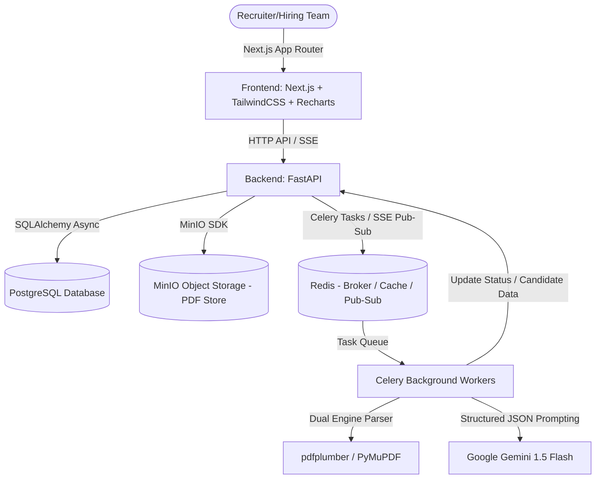

# ResumeAI: AI-Powered Resume Bulk Importer & Intelligent Candidate Categorization System

ResumeAI is a production-grade, containerized web application designed to streamline the recruitment process. It allows hiring teams to create campaigns for specific job roles, bulk-upload candidate resumes (PDFs), parse them asynchronously, extract structured data, and analyze them using Generative AI (Google Gemini). The system ranks candidates against specific campaign requirements, providing actionable insights (scores, strengths, weaknesses, recommendation) and allowing recruiters to manage candidates through a unified hiring pipeline.

---

## 🏗️ Architecture & Technology Stack

The application follows a decoupled, local-first cloud-native architecture powered by Docker Compose.



### Technical Stack Details

*   **Frontend**: 
    *   **Framework**: Next.js (App Router, TypeScript)
    *   **Styling**: TailwindCSS & Vanilla CSS design system (custom variables, warm/neutral dark theme, sleek cards, custom animations)
    *   **Charts**: Recharts (Candidate distribution, Top skills analysis)
    *   **Icons**: Lucide Icons
*   **Backend**:
    *   **API Framework**: FastAPI (Asynchronous Python)
    *   **Database**: PostgreSQL
    *   **ORM**: SQLAlchemy 2.0 (Async) with Alembic for migrations
    *   **Object Storage**: MinIO (S3-compatible storage for storing original uploaded PDFs)
*   **Background Processing**:
    *   **Task Queue & Broker**: Celery & Redis
    *   **Monitoring**: Flower (Celery task monitoring dashboard)
*   **Artificial Intelligence**:
    *   **Model**: Google Gemini 1.5 Flash (via Google GenAI SDK)
    *   **Processing Pipeline**: Asynchronous dual-stage tasks (PDF text extraction -> LLM JSON structuring, analysis, and grading)

---

## 🌟 Key Features

### 1. Hiring Campaign Management
Recruiters organize candidate pipelines into distinct campaigns.
*   **Define Target Role**: Set title (e.g., "AI Engineer") and description.
*   **Required Skills mapping**: Define target skills (e.g., Python, FastAPI, PyTorch) that candidates will be graded against.
*   **Metrics & Analytics**: Inside each campaign, recruiters can view live metrics:
    *   Total uploaded vs. successfully processed vs. failed resumes.
    *   Average candidate matching score.
    *   Top skills distribution among applicants.
    *   Matches distribution (Strong, Moderate, Weak, Rejected).

### 2. High-Performance Bulk Upload
*   **Drag-and-Drop Upload**: Built-in support to upload 20–50 PDF resumes simultaneously.
*   **Validation**: Validates PDF formatting, restricts files exceeding configured limits (default 10MB), and prevents non-PDF uploads.
*   **Idempotency (Duplicate Detection)**: Files are hashed before processing. If a resume has already been processed within the same campaign, the system skips redundant extraction and links the existing candidate profile, saving API tokens.

### 3. Dual-Stage Asynchronous Processing Pipeline
To keep the application highly responsive, resume processing is delegated to Celery background workers across two distinct stages:

| Stage | Worker / Service | Description |
| :--- | :--- | :--- |
| **Stage 1: PDF Extraction** | `extract_queue` | Extracts text from the PDF. It uses a **Hybrid PDF Engine**: tries `pdfplumber` (native text extraction) first, and falls back to `PyMuPDF` or Gemini Vision API for scanned documents/images. |
| **Stage 2: AI Analysis** | `ai_queue` | Sends extracted text to Gemini along with campaign criteria. Gemini returns a structured JSON payload mapping candidate details, scores the candidate against the role, and determines a suitability category. |

### 4. Server-Sent Events (SSE) Real-Time Progress Streaming
*   Instead of polling the database, the frontend connects to a FastAPI Server-Sent Events (SSE) endpoint when a campaign dashboard is open.
*   Celery workers publish progress updates (`Pending` ➔ `Extracting` ➔ `Processing` ➔ `Done` or `Failed`) to Redis.
*   FastAPI listens to Redis Pub/Sub and streams these states directly to the recruiter's UI, displaying a live progress card per file.

### 5. AI Candidate Analysis & Structured Extraction
Gemini 1.5 Flash extracts and structures the following attributes:
*   **Personal Information**: Name, email, phone number, LinkedIn URL, GitHub URL.
*   **Professional Details**: Skills list, detailed work history, projects, certifications, education, and years of experience.
*   **AI Assessment**:
    *   **Candidate Score**: 0 to 100 matching rating based on skills, experience level, and projects.
    *   **Strengths & Weaknesses**: Bullets summarizing the developer's core proficiencies and potential gaps.
    *   **Missing Skills**: Specific skills requested in the campaign that the candidate lacks.
    *   **Recommendation**: A detailed paragraph detailing why they should/should not be interviewed.
    *   **Categorization**: Automatic classification into `Strong Match`, `Moderate Match`, `Weak Match`, or `Rejected`.

### 6. Interactive Recruiter CRM & Candidate Pipeline
Recruiters can override the automated decisions:
*   **Category Override**: Change the candidate's matching tier manually (e.g., promote a "Moderate Match" to "Strong Match").
*   **Pipeline Stage Tracking**: Update candidates through recruiter stages: `Screened` ➔ `Phone Call` ➔ `Technical Interview` ➔ `Offer` ➔ `Hired` (or `Rejected`).
*   **Recruiter Notes**: Add internal text notes directly to candidate profiles for team feedback.

### 7. Search, Filters & Analytics
*   **Dynamic Search**: Instant search by candidate name or specific skill keywords.
*   **Multi-Criteria Filters**: Filter candidates by score ranges, suitability categories, pipeline stages, and years of experience.
*   **Analytics Visualizations**: Live interactive Recharts charts on the campaign page summarizing distribution statistics.

---

## 🔄 End-to-End Processing Workflow

```
[ PDF Uploads ] ──► ( Validate Files )
                         │
                         ▼
             ( Check md5 File Hash ) ──► [ Duplicate Found? ] ──► ( Skip, Link Candidate )
                         │ (No)
                         ▼
             [ Save PDF to MinIO Bucket ]
                         │
                         ▼
            [ Trigger Celery Extract Task ] ──► ( Publish Status: "extracting" via SSE )
                         │
                         ▼
             ( Read PDF Plumber / fitz ) ──► ( Raw Text Extracted )
                         │
                         ▼
            [ Trigger Celery AI Analyser ]  ──► ( Publish Status: "processing" via SSE )
                         │
                         ▼
             ( Prompt Gemini 1.5 Flash ) ──► ( Return Structured JSON Output )
                         │
                         ▼
          [ Save Candidate & Profile to DB ] ──► ( Publish Status: "done" via SSE )
```

---

## 🛠️ Developer Configuration & Health Monitoring

*   **Celery Flower Monitoring**: Live tasks monitoring available out of the box at `http://localhost:5555`.
*   **MinIO Console**: Inspect original resumes stored in buckets at `http://localhost:9001` (credentials in `.env`).
*   **OpenAPI docs**: Interactive Swagger documentation for API endpoints at `http://localhost:8000/docs`.
*   **Fault Tolerance**: Under the hood, Celery tasks are configured to retry up to 3 times with exponential backoff if Gemini API rate limits are hit or network timeouts occur.
